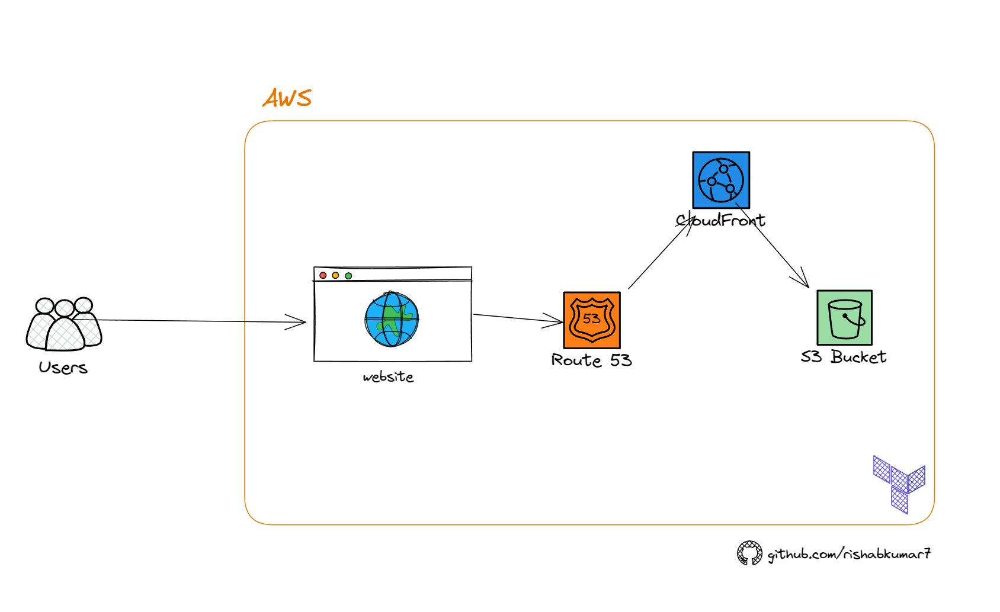

# Terraform AWS S3 Static Site

Host a static website on AWS S3 with Terraform as Infrastructure as Code.

## Architecture

## Tech Stack and AWS Services used

- Terraform for IaC
- AWS S3
- CloudFront
- Route53 (optional)

## More resources

- [Static Site on Azure with Terraform](https://github.com/rishabkumar7/terraform-azure-static-site)
- [Static Site on GCP with Terraform](https://github.com/rishabkumar7/freecodecamp-terraform-with-gcp)

## Author

[Rishab Kumar](https://youtube.com/@rishabincloud)
